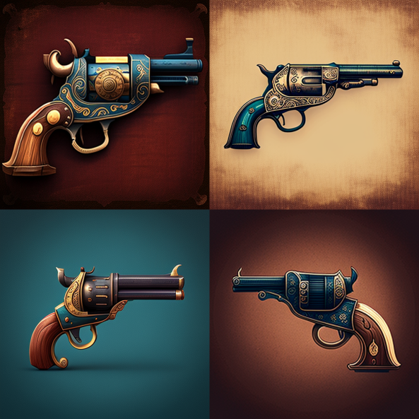
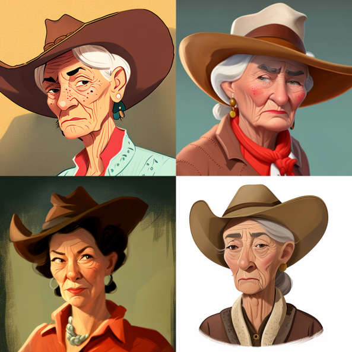
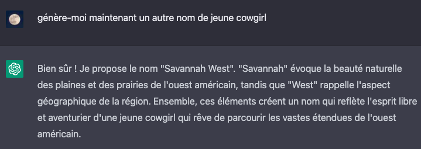

# AI usage

- [AI usage](#ai-usage)
  - [🖼️ MidJourney](#️-midjourney)
  - [📝 ChatGPT](#-chatgpt)

## 🖼️ MidJourney

> Used to generate some assets. Our personnal style is more "cartoon", so we used `in a cartoon style` for each prompt.

1. Logo
   > The name of the game was pre-generated by ChatGPT. We found the name generated on the logo illarious, so we kept it.

   - Prompt: `the logo of a video game in the cartoon style that have shooters in a western arena. The name of the game is "Guns and Glory".`
   - Result (U2): 
   - and many others...

2. Arena
    - Inspiration :
      - Prompt: `far west village map in a cartoon style`.
      - Result: 
    - Some buildings :
      - Prompt: `A western saloon facade in a isometric view and in a cartoon style`
      - Result (U4): 
    - Prompt: `A western building in a isometric view and in a cartoon style`
      - Result (U4): 
      - and many.. many.. many.. others
  
3. Guns
    - Inspiration for the player gun status:
      - Prompt: `a revolver in a cartoon style`.
      - Result: 
    - Colt:
      - Prompt: `a colt 1850 gun in a cartoon style `.
      - Result (U3): 
    - Wyatt Earp Double Barrel Shotgun:
      - Prompt: `a double barrel shotgun 1868 in a cartoon style`.
      - Result (U1): 
    - Winchester:
      - Prompt: `a winchester 1890 gun in a cartoon style`.
      - Result (U1): 
    - and many other prompts...
   
4. Players
    - Yellow:
      - Prompt: `a young western guy face in a cartoon style`.
      - Result (U2): 
    - Orange:
      - Prompt: `a beautiful western guy's face with a hat in a cartoon style`.
      - Result (U4): 
    - Red:
       - Prompt: `a western guy's face with a hat, long hair and a mustache in a cartoon style`.
       - Result (V3): 
    - Blue:
      - Prompt: `a western female face with a hat in a cartoon style`.
      - Result (U3): 
    - Purple:
      - Prompt: `a western female face with a hat in a cartoon style`.
      - Result (U1): 
    - Green:
      - Prompt: `a western women face, aged 50, in a cartoon style`.
      - Result (U1) (with this prompt, it always returned aged woman): 
    - and many other prompts...

5. Bonus/malus (some prompts because there is a loooot of research here)
     - Hamburger: `a humburger item for a video game in a cartoon style`
     - Gun powder: `a gun powder item for a video game in a cartoon style`
     - Golden bullet: `a golden bullet item for a video game in a cartoon style`
     - Rifle scope: `a rifle scope item for a video game in a cartoon style`
     - Whiskey: `a whiskey bottle item for a video game in a cartoon style`
     - Some bullets: `an amat of rifle bullets item for a video game in a cartoon style`
     - ...
    > For the mug, we wanted a mug of one color, but the AI returned always mugs with things on it. This must be because of the `in a cartoon style` text in our request.

## 📝 ChatGPT

> Used to generate the first idea of the game name and to generate players names

1. Game name

> The name has been used to generate the logo of the game

2. Players names
    > The request was based on the images that MidJourney generated. We liked each generated names (and their stories) so we kept them.
  - Yellow player :
    
  - Orange player :
    
  - Red player :
    
  - Blue player :
    
  - Purple player :
    
  - Green player :
    
